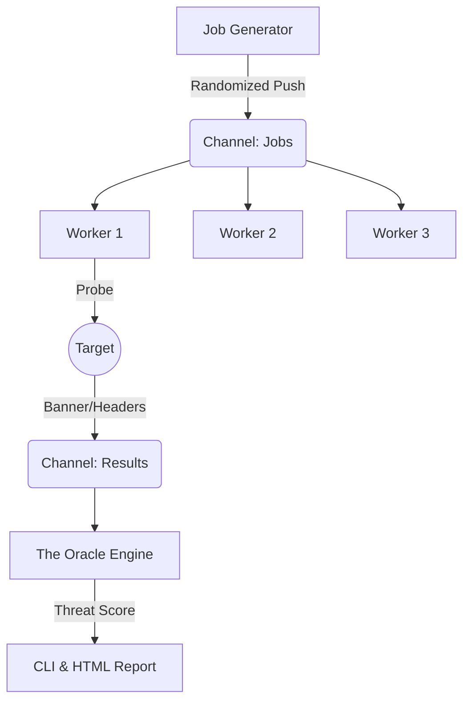

# 👁️ ARGOS PANOPTES

> **A blazing fast, concurrent network scanner written in pure Go.**
> *Built for speed, precision, stealth, and style.*


---

## 📖 Overview

**Argos** is a next-generation TCP port scanner designed for Red Team operations and Network Administration. Unlike traditional threaded scanners, Argos leverages **Golang's Goroutines** and **Channels** to handle thousands of concurrent connections with minimal resource overhead.

Now featuring **"The Oracle" Engine**, Argos goes beyond simple port scanning by providing Threat Assessment, Web Intelligence, and tactical presets.

### ✨ Key Features

* **🧠 The Oracle Intelligence (NEW):** Automatically calculates a **Threat Score** based on open ports and identifies critical vulnerabilities.
* **🌐 Web Recon Module (NEW):** Silent extraction of HTTP Titles and Server Headers for ports 80, 443, 8080, etc.
* **📊 HTML Tactical Report (NEW):** Generates a stunning Dark Mode HTML report for professional presentation.
* **🎮 Tactical Modes:** Pre-configured scanning profiles (`SCOUT`, `SHADOW`, `BLITZ`, `TITAN`) adapted to any situation.
* **🚀 High Performance:** Scans massive networks in seconds using a Worker Pool architecture.
* **👻 Stealth & Evasion:** "Shadow" mode implements randomized jitter and port shuffling to evade IDS/IPS.
* **🎨 Cyberpunk UX:** Features a TrueColor gradient CLI, animated progress bars, and threat level indicators.

---

## ⚡ Installation

### Prerequisites
* **Go 1.21** or higher installed on your machine.
* **Make** (optional, recommended).

### Build from Source

```bash
# 1. Clone the repository
git clone [https://github.com/StaiLee/Argos.git](https://github.com/StaiLee/Argos.git)
cd Argos

# 2. Build and Install (Linux/Mac)
go build -o argos main.go
sudo mv argos /usr/local/bin/

# 3. Verify installation
argos
```

---

## 🚀 Usage

Argos uses a "Tactical Mode" system to simplify usage.

```bash
argos -host <TARGET> [FLAGS]
```

### 🛡️ Tactical Guide (Modes)

Argos comes with 4 battle-tested presets. Select one using the `-mode` flag.

| Mode | Code | Description | Best Use Case |
| :--- | :--- | :--- | :--- |
| **SCOUT** | `-mode scout` | **(Default)** Balanced speed & noise. Top 1024 ports. | Initial Recon, Daily Checks. |
| **SHADOW**| `-mode shadow`| **Stealth / Evasion.** Slow, high jitter, randomized order. | Red Teaming, Evasion, Anti-IDS. |
| **BLITZ** | `-mode blitz` | **Aggressive Strike.** Max speed, no delay. Very noisy. | CTFs, Internal Labs, Fast Sweep. |
| **TITAN** | `-mode titan` | **Deep Audit.** Scans ALL 65,535 ports. Heavy load. | Full Vulnerability Assessment. |

### 🚩 Available Flags

| Flag | Description | Example |
| :--- | :--- | :--- |
| `-host` | **(Required)** Target IP or CIDR range. | `192.168.1.1` or `10.0.0.0/24` |
| `-mode` | Select a tactical profile (see above). | `-mode titan` |
| `-html` | **(NEW)** Generate a visual HTML Intelligence Report. | `-html report.html` |
| `-json` | Export results to JSON format. | `-json output.json` |
| `-p` | Override ports (Comma separated or Range). | `-p 80,443` or `-p 1-5000` |
| `-random`| Force port shuffling (Anti-IDS). | `-random` |

---

## 💡 Examples

**1. Quick Recon (Default)**
Scans top 1024 ports with balanced settings.
```bash
argos -host 192.168.1.15
```

**2. The "Ghost Protocol" (Stealth)**
Scans slowly with randomized delays to bypass firewalls.
```bash
argos -host 10.10.10.5 -mode shadow
```

**3. Full Audit with Reporting (Professional)**
Scans all 65k ports and generates a client-ready HTML report.
```bash
argos -host 10.10.10.5 -mode titan -html audit_report.html
```

**4. Web Server Hunt (CIDR)**
Find all web servers on a subnet very quickly.
```bash
argos -host 192.168.1.0/24 -p 80,443 -mode blitz
```

---

## 🏗️ Technical Architecture

Argos was built to demonstrate the power of **Concurrency vs. Parallelism** in Network Engineering.

### The Worker Pool Pattern
Instead of spawning a new thread for every port (which crashes the OS), Argos uses a fixed pool of workers:

1.  **The Feeder:** A main Goroutine generates jobs (Target IP + Port) and pushes them into a buffered `channel`.
2.  **The Workers:** A user-defined number of workers pull jobs from the channel.
3.  **The Oracle:** Analyzes responses (Banner Grabbing, HTTP Headers) to compute a Risk Score.
4.  **The Reporter:** Aggregates data into JSON/HTML formats.



---

## ⚠️ Disclaimer

**Argos is intended for educational and authorized testing purposes only.**
Scanning networks without permission is illegal in many jurisdictions. The developers assume no liability for misuse of this tool.

---

## 📜 License

Distributed under the MIT License. See `LICENSE` for more information.