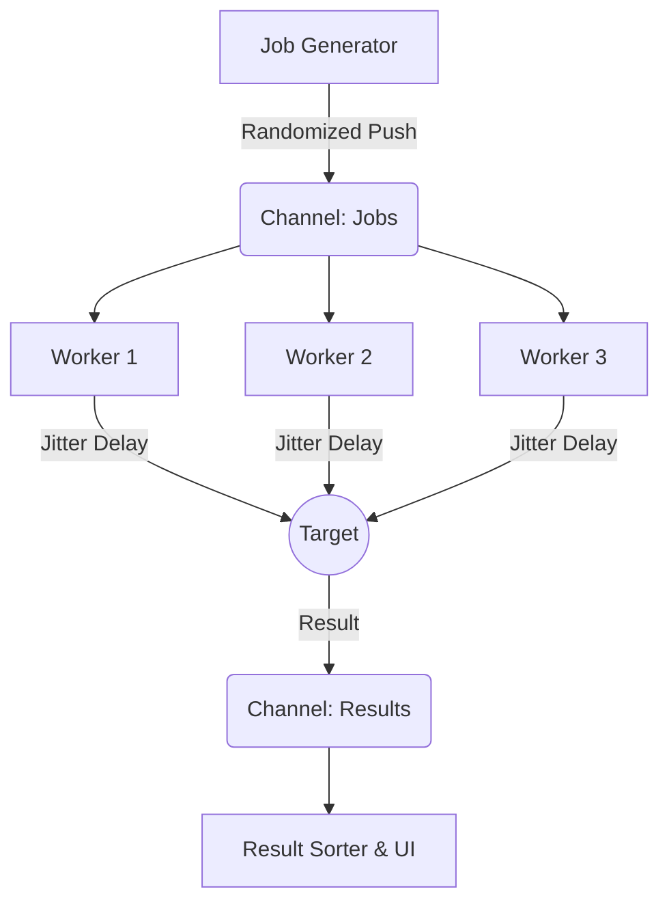

# 👁️ ARGOS PANOPTES

> **A blazing fast, concurrent network scanner written in pure Go.**
> *Built for speed, precision, stealth, and style.*


---

## 📖 Overview

**Argos** is a next-generation TCP port scanner designed for Red Team operations and Network Administration. Unlike traditional threaded scanners, Argos leverages **Golang's Goroutines** and **Channels** to handle thousands of concurrent connections with minimal resource overhead.

Named after the Greek giant with a hundred eyes, this tool ensures nothing on your network goes unnoticed.

### ✨ Key Features

* **🚀 High Performance:** Scans massive networks in seconds using a Worker Pool architecture.
* **👻 Stealth Mode (NEW):** Can be launched in "Ghost Mode". The console window is automatically hidden upon execution to run silently in the background.
* **🎲 Randomization & Jitter (NEW):** Implements random delays between packets and randomizes port scanning order to evade IDS/IPS detection and firewall rate-limiting.
* **🎨 Cyberpunk UX:** Features a TrueColor gradient CLI interface with animated boot sequences and progress bars.
* **🌐 CIDR Support:** Natively supports subnet scanning (e.g., `192.168.1.0/24`).
* **🧠 Smart Fingerprinting:** Performs Banner Grabbing to identify running services (SSH, HTTP, FTP, etc.).
* **💾 JSON Export:** Outputs results to JSON for easy integration with other tools or reporting.
* **🛠️ Makefile Integration:** Fully automated build process including stealth builds.

---

## ⚡ Installation

### Prerequisites
* **Go 1.21** or higher installed on your machine.
* **Make** (optional, but recommended for building).

### Build from Source

We utilize a `Makefile` to handle standard and stealth compilations easily.

```bash
# 1. Clone the repository
git clone [https://github.com/StaiLee/Argos.git](https://github.com/StaiLee/Argos.git)
cd Argos

# 2. Standard Build (Visible Console)
make

# 3. Stealth Build (No Console Window on Windows)
make stealth

# 4. Clean up artifacts
make clean
```

*Note: The `make stealth` command applies specific linker flags (`-ldflags -H=windowsgui`) to remove the console window.*

---

## 🚀 Usage

Argos is designed to be intuitive. The basic syntax is:

```bash
./argos -host <TARGET> [FLAGS]
```

### 🚩 Available Flags

| Flag | Description | Default |
| :--- | :--- | :--- |
| `-host` | Target IP or CIDR range (e.g., `192.168.1.1` or `10.0.0.0/24`) | `127.0.0.1` |
| `-p` | Ports to scan. Supports list (`80,443`), range (`1-1000`), or `all`. | `1-1024` |
| `-t` | Number of concurrent workers (threads). | `500` |
| `-timeout`| Connection timeout in milliseconds. | `500` |
| `-jitter` | **(NEW)** Max random delay (ms) between requests to avoid detection. | `0` (Disabled) |
| `-stealth`| **(NEW)** Activate internal stealth logic (suppress non-critical output). | `false` |
| `-json` | File path to export results (e.g., `results.json`). | *(None)* |

### 💡 Examples

**1. Quick Health Check (Default)**
Scans the top 1024 ports of a single machine.
```bash
./argos -host 192.168.1.15
```

**2. The "Ghost Scan" (Evasion Mode)**
Scans with a random jitter (0-200ms delay) and hides output clutter to stay under the radar.
```bash
./argos -host 10.10.10.5 -p 1-5000 -jitter 200 -stealth
```

**3. Subnet Sweep (CIDR)**
Scans the entire `192.168.1.x` network for Web Services (80, 443).
```bash
./argos -host 192.168.1.0/24 -p 80,443
```

---

## 🏗️ Technical Architecture

Argos was built to demonstrate the power of **Concurrency vs. Parallelism** in Network Engineering.

### The Worker Pool Pattern
Instead of spawning a new thread for every port (which crashes the OS), Argos uses a fixed pool of workers:

1.  **The Feeder:** A main Goroutine generates jobs (Target IP + Port) and pushes them into a buffered `channel`. *Now supports randomized order.*
2.  **The Workers:** A user-defined number of workers (default: 500) pull jobs from the channel.
3.  **The Jitter Engine:** If enabled, workers sleep for a `rand.Intn(jitter)` duration before dialing.
4.  **The WaitGroup:** Ensures the program waits for all workers to finish before exiting.



---

## ⚠️ Disclaimer

**Argos is intended for educational and authorized testing purposes only.**
Scanning networks without permission is illegal in many jurisdictions. The developers assume no liability for misuse of this tool.

---

## 📜 License

Distributed under the MIT License. See `LICENSE` for more information.