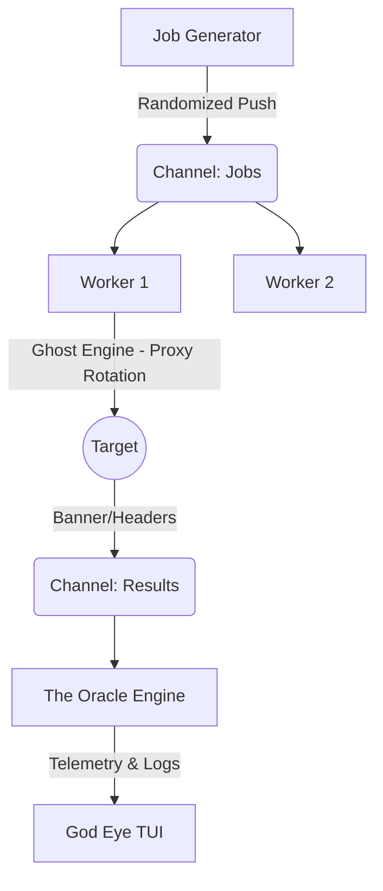

# 👁️ ARGOS PANOPTES

> **The Ultimate Tactical Network Scanner.**
> *Speed. Precision. Cyber-Warfare UX.*


---

## 📖 Overview

**Argos Panoptes** is not just a port scanner; it is a **Cyber-Reconnaissance Command Center**.

Built in pure Golang, it leverages a massive concurrent architecture to scan networks at blazing speeds while providing a cinematic, **"God Eye" TUI** (Terminal User Interface). Unlike traditional tools that output static text, Argos deploys a live, interactive war room dashboard.

### ✨ OMEGA Features (v5.3.0)

* **👻 Ghost Protocol (NEW):** Integrated **Rotating Proxy Engine**. Load a list of SOCKS5/HTTP proxies to anonymize every request and evade IP bans.
* **🧠 Identity Engine:** Active Service Fingerprinting via the `-deep` flag. Extracts SSH versions, FTP banners, and SMTP greetings.
* **📺 God Eye Dashboard:** A responsive, split-view TUI featuring real-time telemetry, **network activity sparklines**, and system diagnostics (RAM/CPU/Goroutines).
* **🔮 The Oracle Engine:** Automatic **Risk Assessment Scoring** (Critical/High/Low) and **Web Intelligence** extraction (HTTP Titles & Server Headers).
* **🎨 Dynamic Tactical Themes:**
    * 🔥 **BLITZ:** High-contrast Neon Red/Gold.
    * ❄️ **TITAN:** Deep Corporate Cyan/Blue.
    * 👻 **SHADOW:** Monochrome Stealth.
    * 🍀 **SCOUT:** Retro Matrix Green.
* **🚀 Plasma Progress Bar:** A custom-rendered, fluid progress bar that reflects the exact operational theme colors.

---

## ⚡ Installation

### Prerequisites
* **Go 1.21** or higher installed.
* A terminal with **TrueColor** support (e.g., Terminator, iTerm2, Alacritty, VSCode).

### Build from Source

```bash
# 1. Clone the repository
git clone [https://github.com/StaiLee/Argos.git](https://github.com/StaiLee/Argos.git)
cd Argos

# 2. Install dependencies (BubbleTea framework & Proxy libs)
go mod tidy

# 3. Build the binary
go build -o argos main.go

# 4. Install to system path
sudo mv argos /usr/local/bin/
```

---

## 🚀 Usage

Argos uses a "Tactical Mode" system to simplify complex scanning operations.

```bash
argos -host <TARGET> [FLAGS]
```

### 🛡️ Tactical Guide (Modes)

Argos comes with 4 battle-tested presets. Select one using the `-mode` flag.

| Mode | Code | Description | Best Use Case |
| :--- | :--- | :--- | :--- |
| **SCOUT** | `-mode scout` | **(Default)** Balanced speed & noise. Top 1024 ports. | Initial Recon, Daily Checks. |
| **SHADOW**| `-mode shadow`| **Stealth / Evasion.** Slow, high jitter, randomized order. | Red Teaming, Evasion, Anti-IDS. |
| **BLITZ** | `-mode blitz` | **Aggressive Strike.** Max speed, no delay. Very noisy. | CTFs, Internal Labs, Fast Sweep. |
| **TITAN** | `-mode titan` | **Deep Audit.** Scans ALL 65,535 ports. Heavy load. | Full Vulnerability Assessment. |

### 🚩 Advanced Flags

| Flag | Description |
| :--- | :--- |
| `-deep` | Enable Active Identity Grabbing. Extracts SSH versions, Web Headers, and FTP banners. Slower but richer. |
| `-proxy` | **(NEW)** Enable **Ghost Mode**. Provide a path to a JSON proxy list (e.g., generated by *ProxyHarvester*). |
| `-p` | Override ports (e.g., `-p 22,80` or `-p 1-5000`). |
| `-random` | Force port shuffling to evade simple firewall rules. |
| `-json` / `-html` | Export results to file. |

### 💡 Advanced Examples

**1. The "Ghost Mode" Scan (Anonymity)**
Scan a target while rotating IP addresses for every connection using a proxy list.
```bash
argos -host target.com -proxy proxies_elite.json -mode scout
```

**2. The "Deep Identity" Scan**
Identify service versions (SSH, Apache, Nginx) alongside open ports.
```bash
argos -host 10.10.10.5 -mode scout -deep
```

**3. Subnet Sweep (Blitz Mode)**
Scan an entire range for Web Servers (80, 443, 8080) in seconds.
```bash
argos -host 192.168.1.0/24 -p 80,443,8080 -mode blitz
```

**4. Stealth Operation (Shadow Mode)**
Bypass firewalls using randomized port shuffling and jitter delays.
```bash
argos -host target.corp -mode shadow -p 1-5000 -random
```

---

## 🏗️ Technical Architecture

Argos demonstrates the power of **Go Concurrency Patterns** mixed with the **ELM Architecture**:

1.  **The Feeder:** Pushes targets into a buffered channel.
2.  **The Worker Pool:** Spawns 500-2000 micro-threads (Goroutines).
3.  **The Ghost Engine:** Intercepts connections and routes them through a rotating SOCKS5/HTTP proxy pool.
4.  **The Identity Module:** Performs active probes (Banner Grabbing, HEAD requests).
5.  **The Oracle:** Analyzes responses to compute a Risk Score.
6.  **The UI Engine (Bubble Tea):** Renders the TUI at 60fps.



---

## ⚠️ Disclaimer

**Argos is intended for educational and authorized security testing purposes only.**
Scanning networks without permission is illegal in many jurisdictions. The developers assume no liability for misuse of this tool.

---

## 📜 License

Distributed under the MIT License. See `LICENSE` for more information.