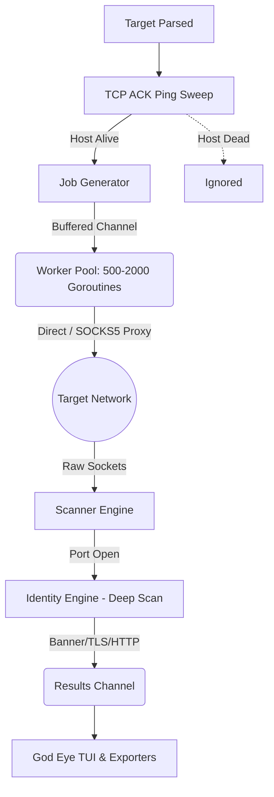

# 👁️ ARGOS PANOPTES

> **The Ultimate Tactical Network Scanner.**
> *Speed. Precision. Cyber-Warfare UX.*


---

## 📖 Overview

**Argos Panoptes** is not just a port scanner; it is a **Cyber-Reconnaissance Command Center**.

Built in pure Golang, it leverages a massive concurrent architecture to scan networks at blazing speeds while providing a cinematic, **"God Eye" TUI** (Terminal User Interface). Unlike traditional tools that output static text, Argos deploys a live, interactive war room dashboard.

Under the hood, Argos v5.5 introduces kernel-level optimizations, zero-allocation memory pools, and advanced passive fingerprinting to match the capabilities of industry-standard tools like Nmap, but with a fraction of the memory footprint.

### ✨ SUPREME Features (v5.5.0)

* **🛰️ Ping Sweep Radar (NEW):** Intelligent host discovery via ultra-fast TCP ACK probes. Skips dead IPs automatically, saving 95% of scan time on empty subnets. Can be bypassed with `-Pn`.
* **⚙️ Kernel Tuner (NEW):** Automatically maximizes the OS File Descriptor limits (`RLIMIT_NOFILE`) to allow massive concurrency (>65,000 sockets) without crashing.
* **👻 Ghost Protocol:** Integrated **Rotating Proxy Engine**. Encapsulate raw TCP sockets into SOCKS5 tunnels to anonymize requests and evade IP bans.
* **🧠 Identity Engine v2:** Active Service Fingerprinting via the `-deep` flag. 
    * **TLS Interception:** Extracts Common Names (CN) to reveal hidden domains behind CDNs.
    * **HTTP Probing:** Captures `<title>` tags and `Server` headers.
    * **Sanitized Banner Grabbing:** Captures SSH/FTP banners with built-in XSS protection for HTML reporting.
* **📺 God Eye Dashboard:** A responsive, split-view TUI featuring real-time telemetry, 60fps lock-free rendering, and system diagnostics.
* **🔮 The Oracle Engine:** Automatic **Risk Assessment Scoring** (Critical/High/Low).
* **🎨 Dynamic Tactical Themes:**
    * 🔥 **BLITZ:** High-contrast Neon Red/Orange.
    * ❄️ **TITAN:** Deep Corporate Cyan/Blue.
    * 👻 **SHADOW:** Monochrome Stealth.
    * 🍀 **SCOUT:** Retro Matrix Green.

---

## ⚡ Installation

### Prerequisites
* **Go 1.22** or higher installed.
* A terminal with **TrueColor** support.
* Linux/macOS recommended for optimal kernel tuning (`ulimit` unlocking).

### Build from Source

```bash
# 1. Clone the repository
git clone https://github.com/StaiLee/Argos.git
cd Argos

# 2. Build the optimized industrial binary using the Makefile
make build

# 3. (Optional) Install to system path
sudo mv argos /usr/local/bin/
```

---

## 🚀 Usage

Argos uses a "Tactical Mode" system to simplify complex scanning operations.

```bash
./argos -host <TARGET> [FLAGS]
```

### 🛡️ Tactical Guide (Modes)

Argos comes with 4 battle-tested presets. Select one using the `-mode` flag.

| Mode | Code | Description | Best Use Case |
| :--- | :--- | :--- | :--- |
| **SCOUT** | `-mode scout` | **(Default)** Balanced speed & noise. Top 1024 ports. | Initial Recon, Daily Checks. |
| **SHADOW**| `-mode shadow`| **Stealth / Evasion.** Slow, high jitter. | Red Teaming, Evasion, Anti-IDS. |
| **BLITZ** | `-mode blitz` | **Aggressive Strike.** Max speed (2000 threads). | CTFs, Internal Labs, Fast Sweep. |
| **TITAN** | `-mode titan` | **Deep Audit.** Scans ALL 65,535 ports. Heavy load. | Full Vulnerability Assessment. |

### 🚩 Advanced Flags

| Flag | Description |
| :--- | :--- |
| `-deep` | Enable the Identity Engine (HTTP Titles, TLS Certs, Banners). |
| `-Pn` | **Skip Ping**. Force the scan of all IP addresses even if they seem dead. |
| `-random` | Force port shuffling to evade linear firewall detection (IDS). |
| `-proxy` | Enable **Ghost Mode**. Path to a JSON list of SOCKS5 proxies. |
| `-p` | Override ports (e.g., `-p 22,80` or `-p 1-5000` or `-p all`). |
| `-json` | Export results to secure JSON file. |
| `-html` | Export results to secure HTML report. |

### 💡 Tactical Examples

**1. The "Ghost Mode" Scan (Anonymity)**
Scan a target while routing connections through SOCKS5 proxies with shuffled ports.
```bash
./argos -host target.com -proxy proxies_elite.json -mode shadow -random
```

**2. Deep Infrastructure Audit**
Scan all 65k ports, extract TLS certs, and generate a client-ready HTML report.
```bash
./argos -host 10.10.10.5 -mode titan -deep -p all -html report.html
```

**3. Subnet Sweep (Bypass Ping)**
Scan an entire /24 network aggressively, forcing the scan even if ICMP/Ping is blocked.
```bash
./argos -host 192.168.1.0/24 -p 22,80,443,445 -mode blitz -Pn
```

---

## 🏗️ Technical Architecture (Clean Architecture)

Argos demonstrates the ultimate power of **Go Concurrency Patterns** and **Zero-Allocation Memory Management**:

1.  **Kernel Tuner:** Overrides Linux FD limits via `syscall.Setrlimit`.
2.  **The Feeder (CIDR Math):** Uses Bitwise operations to calculate IP ranges in microseconds without RAM overhead.
3.  **Host Discovery:** Runs asynchronous TCP ACK probes to drop dead IPs instantly.
4.  **Worker Pool:** Employs atomic counters (`sync/atomic`) and `sync.Pool` to reuse buffers, drastically reducing the Garbage Collector (GC) pressure.
5.  **Ghost Engine:** Dynamically injects `ContextDialer` to mutate standard sockets into SOCKS5 wrapped connections.
6.  **God Eye UI:** MVU (Model-View-Update) architecture rendering at 60fps without blocking network operations.


```mermaid
graph TD;
    Config[Target Parsed] --> Ping[TCP ACK Ping Sweep];
    Ping -->|Host Alive| Feeder[Job Generator];
    Ping -.->|Host Dead| Dropped[Ignored];
    Feeder -->|Buffered Channel| Workers(Worker Pool: 500-2000 Goroutines);
    Workers -->|Direct / SOCKS5 Proxy| Target((Target Network));
    Target -->|Raw Sockets| Scanner[Scanner Engine];
    Scanner -->|Port Open| Identity[Identity Engine - Deep Scan];
    Identity -->|Banner/TLS/HTTP| Results(Results Channel);
    Results --> Dashboard[God Eye TUI & Exporters];
```

---

## ⚠️ Disclaimer

**Argos is intended for educational and authorized security testing purposes only.**
Scanning networks without explicit permission is illegal. The developer assumes no liability for misuse of this tool or damage caused by aggressive scanning modes.

---

## 📜 License

Distributed under the MIT License. See `LICENSE` for more information.
