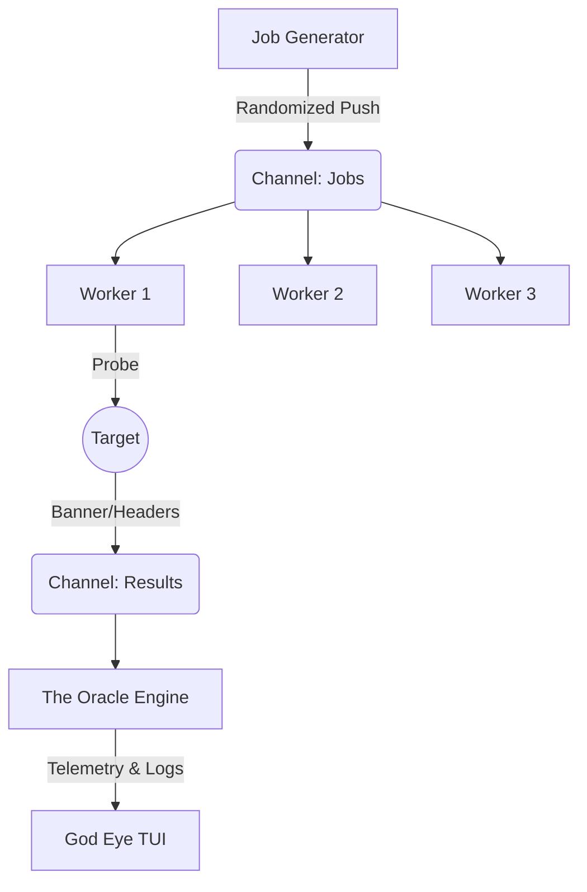

# 👁️ ARGOS PANOPTES

> **The Ultimate Tactical Network Scanner.**
> *Speed. Precision. Cyber-Warfare UX.*


---

## 📖 Overview

**Argos Panoptes** is not just a port scanner; it is a **Cyber-Reconnaissance Command Center**. 

Built in pure Golang, it leverages a massive concurrent architecture to scan networks at blazing speeds while providing a cinematic, **"God Eye" TUI** (Terminal User Interface). Unlike traditional tools that output static text, Argos deploys a live, interactive war room dashboard.

### ✨ OMEGA Features (v5.0.0)

* **📺 OMEGA Dashboard:** A responsive, split-view TUI featuring real-time telemetry, **network activity sparklines**, and system diagnostics (RAM/CPU/Goroutines).
* **🧠 The Oracle Engine:** Automatic **Risk Assessment Scoring** (Critical/High/Low) and **Web Intelligence** extraction (HTTP Titles & Server Headers).
* **🎨 Dynamic Tactical Themes:**
    * 🔥 **BLITZ:** High-contrast Neon Red/Gold.
    * ❄️ **TITAN:** Deep Corporate Cyan/Blue.
    * 👻 **SHADOW:** Monochrome Stealth.
    * 🍀 **SCOUT:** Retro Matrix Green.
* **🚀 Plasma Progress Bar:** A custom-rendered, fluid progress bar that reflects the exact operational theme colors.
* **🛡️ Interactive Manual:** Built-in digital documentation reader accessible directly from the CLI.

---

## ⚡ Installation

### Prerequisites
* **Go 1.21** or higher installed.
* A terminal with **TrueColor** support (e.g., Terminator, iTerm2, Alacritty, VSCode).

### Build from Source

```bash
# 1. Clone the repository
git clone [https://github.com/StaiLee/Argos]
cd Argos

# 2. Install dependencies (BubbleTea framework)
go mod tidy

# 3. Build the binary
go build -o argos main.go

# 4. Install to system path
sudo mv argos /usr/local/bin/
```

---

## 🚀 Usage

Argos uses a "Tactical Mode" system to simplify complex scanning operations.

```bash
argos -host <TARGET> [FLAGS]
```

### 🛡️ Tactical Guide (Modes)

Argos comes with 4 battle-tested presets. Select one using the `-mode` flag.

| Mode | Code | Description | Best Use Case |
| :--- | :--- | :--- | :--- |
| **SCOUT** | `-mode scout` | **(Default)** Balanced speed & noise. Top 1024 ports. | Initial Recon, Daily Checks. |
| **SHADOW**| `-mode shadow`| **Stealth / Evasion.** Slow, high jitter, randomized order. | Red Teaming, Evasion, Anti-IDS. |
| **BLITZ** | `-mode blitz` | **Aggressive Strike.** Max speed, no delay. Very noisy. | CTFs, Internal Labs, Fast Sweep. |
| **TITAN** | `-mode titan` | **Deep Audit.** Scans ALL 65,535 ports. Heavy load. | Full Vulnerability Assessment. |

### 🚩 Advanced Examples

**1. The "God Eye" Experience (Titan Mode)**
Launch a full audit with the Blue/Cyan theme and detailed logs.
```bash
argos -host 10.10.50.2 -mode titan
```

**2. Subnet Sweep (Blitz Mode)**
Scan an entire range for Web Servers (80, 443, 8080) in seconds.
```bash
argos -host 192.168.1.0/24 -p 80,443,8080 -mode blitz
```

**3. Stealth Operation (Shadow Mode)**
Bypass firewalls using randomized port shuffling and jitter delays.
```bash
argos -host target.corp -mode shadow -p 1-5000 -random
```

**4. Reporting**
Export results to JSON for processing or HTML for client presentation.
```bash
argos -host 127.0.0.1 -json results.json -html report.html
```

---

## 🏗️ Technical Architecture

Argos demonstrates the power of **Go Concurrency Patterns** mixed with the **ELM Architecture**:

1.  **The Feeder:** Pushes targets into a buffered channel.
2.  **The Worker Pool:** Spawns 500-2000 micro-threads (Goroutines) to handle network I/O efficiently.
3.  **The Oracle:** Analyzes responses (Banner Grabbing, HTTP Headers) to compute a Risk Score.
4.  **The UI Engine (Bubble Tea):** Renders the TUI at 60fps, handling keyboard events and window resizing without blocking the scan logic.



---

## ⚠️ Disclaimer

**Argos is intended for educational and authorized security testing purposes only.**
Scanning networks without permission is illegal in many jurisdictions. The developers assume no liability for misuse of this tool.

---

## 📜 License

Distributed under the MIT License. See `LICENSE` for more information.